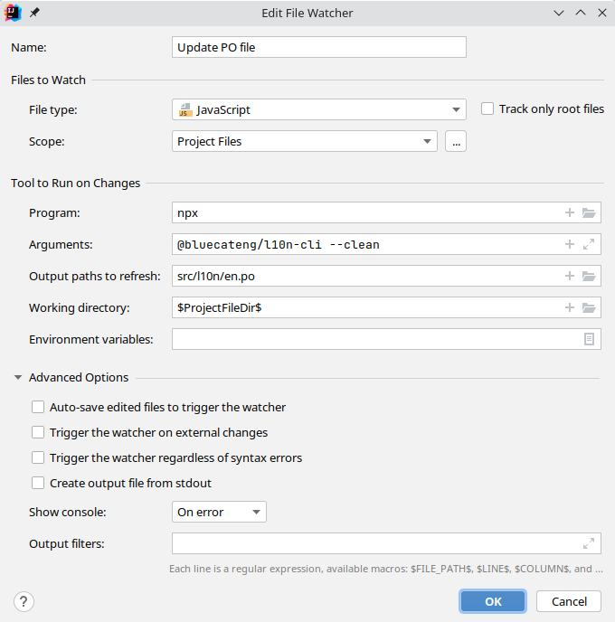

# `@bluecat/l10n-cli`

Command line utilities for l10n.

## Installation

```shell
npm i -D @bluecat/l10n-cli
```

## Configuration

Add an object with this format to `package.json`. All paths are relative to the directory where `package.json` is located.

```
"bc-l10n": {
  "hashLength": <number>,
  "sourcePath": <string>,
  "module": <string>,
  "catalogPath": <string>,
  "locales": <Array<string>>
}
```

### hashLength

To save space in production the code only contains a hash of the original string.
This field specifies the length to which the hashes will be truncated.
It should be the minimum length which avoids clashes, clashes are validated at build time.

- Required: yes
- Example: `3`

### sourcePath

The path to the sources.

- Required: no
- Default: `"src"`

### module

The path to the module which loads the strings (see `@bluecat/l10n-core`).

- Required: yes
- Example: `"src/l10n"`

### catalogPath

The path where the message catalog files will be created.
It must contain the token "{locale}" which will be replaced with the corresponding locale.
It must not contain an extension, the extension will be appended on generation.

- Required: yes
- Example: `"src/l10n/{locale}"`

### locales

List of [BCP-47](https://www.rfc-editor.org/rfc/bcp/bcp47.txt) locale codes.

- Required: no
- Default: `["en"]`
- Example: `["en", "fr"]`

## Usage

The command line can be used in two modes:

- during development to extract strings from individual files for a single locale.
- before committing to extract strings from all source files for all configured locales.

`npx @bluecat/l10n-cli [ -l <locale> ] [ <file-paths> ... ]`

### locale

The single locale code to update. If not specified, all the configured locales will be updated.

### file-paths

The paths to the source files from which strings will be extracted.
If not specified, all the source files will be scanned.

## Usage as a file watcher in JetBrains IDEs (WebStorm/IDEA)

This configuration can be added under Settings > Tools > File Watchers.


